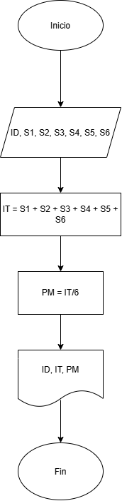
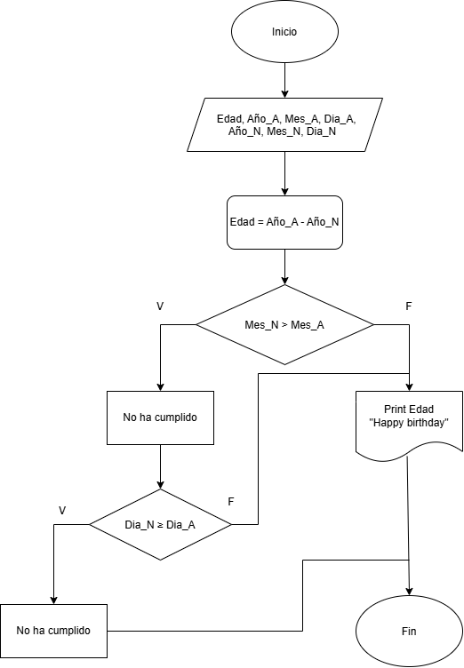

# 📘 Actividad de Análisis y Solución de Algoritmos

---

## 📌 Situación 1
---

### 📝 Planteamiento

> Analicemos el siguiente problema y representemos su solución mediante un algoritmo secuencial.

**Problema:**

- Construye un algoritmo que, al recibir como datos **el ID** del empleado y los seis primeros sueldos del año, calcule el ingreso total semestral y el promedio mensual, e imprima el ID del empleado, el ingreso total y el promedio mensual.

---

### ✅ Solución

El algoritmo comienza solicitando el **ID del empleado** y los seis sueldos correspondientes al primer semestre del año (**S1, S2, S3, S4, S5 y S6**).

A continuación, suma los seis salarios para obtener el **Ingreso Total (IT)** del semestre.

Después, calcula el **Promedio Mensual (PM)** dividiendo el ingreso total entre seis.

Finalmente, muestra el **ID del empleado**, el **ingreso total semestral** y el **promedio mensual**, y termina la ejecución del proceso.

---

### 🖼️  Diagrama de Flujo

---

### 📊 Datos de Entrada

=======
| NOMBRE | DEFINICIÓN | TIPO | UNIDAD |
|---------|------------|------|---------|
| ID | | Entero | - |
| S1-S6 | | Real | $ |

---

### 📊 Datos de Salida

| NOMBRE | DEFINICIÓN | TIPO | UNIDAD |
|---------|------------|------|---------|
| ID | | Entero | - |
| IT | | Real | $ |
| PM | | Real | $ |

---
---

## 📌 Situación 2

---

### 📝 Planteamiento

> Analicemos el siguiente problema y representemos su solución mediante un algoritmo secuencial.

**Problema:**

- Construye un algoritmo que reciba como datos la fecha de nacimiento de una persona (año, mes y día) y la fecha actual (año, mes y día). El algoritmo deberá calcular la edad actual de la persona y determinar si ya ha cumplido años en el año en curso. Finalmente, deberá mostrar la edad correspondiente y un mensaje indicando si la persona ya cumplió años o si aún no ha llegado la fecha de su cumpleaños.

---

### ✅ Solución

El algoritmo recibe como datos la fecha de nacimiento de una persona (año, mes y día) y la fecha actual. Primero calcula una edad preliminar restando el año de nacimiento al año actual. Luego compara el mes actual con el mes de nacimiento para determinar si el cumpleaños ya ocurrió durante el año en curso. Si el mes actual es mayor que el mes de nacimiento, se considera que la persona ya cumplió años y se muestra la edad calculada. En caso contrario, se verifica si el día actual es igual o mayor que el día de nacimiento. Si esta condición se cumple, también se considera que ya cumplió años; de lo contrario, se indica que aún no ha cumplido años. Finalmente, el algoritmo muestra el resultado correspondiente y termina su ejecución.

---
### 🖼️  Diagrama de Flujo

---

### 📊 Datos de Entrada

| NOMBRE | DEFINICIÓN | TIPO | UNIDAD |
|---------|------------|------|---------|
| Año_N| Año de Nacimiento | Entero | - |
| Año_A| Año Actual | Entero | - |
| Mes_N| Mes de Nacimiento | Entero | - |
| Mes_A| Mes Actual | Entero | - |
| Día_N| Día de Nacimiento | Entero | - |
| Día_A| Día Actual | Entero | - |

---

### 📊 Datos de Salida

| NOMBRE | DEFINICIÓN | TIPO | UNIDAD |
|---------|------------|------|---------|
| Cumple Hb | | - | - |

---

